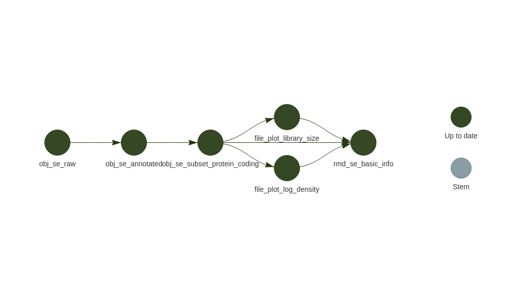

# Rmd_targets_RNA-seq

RNA-seq解析用のtargetsベースパイプライン

## 概要 / Overview

このリポジトリは、RNA-seq解析をRマークダウンとtargetsパッケージを使用して実行するためのパイプラインフレームワークを提供します。これにより、再現性の高い解析ワークフローを構築できます。

This repository provides a pipeline framework for RNA-seq analysis using R Markdown and the targets package, enabling reproducible analysis workflows.

### English Overview

This RNA-seq analysis pipeline framework implements a reproducible workflow for gene expression analysis. It uses the R targets package to create a directed acyclic graph of dependencies, ensuring that only necessary steps are re-run when inputs change. Combined with R Markdown reports, it creates a fully documented and reproducible analysis environment.

## 機能 / Features

- 再現性のある解析ワークフロー (Rの`targets`パッケージ使用)
- カウントデータからSummarizedExperimentオブジェクトの作成
- 設定ファイルによる実験固有パラメータの管理
- Rマークダウンによる解析レポート生成
- ログ機能による実行履歴の記録
- biomaRtを使用した遺伝子アノテーション

## セットアップ / Setup

```bash
# リポジトリのクローン
git clone <repository-url>
cd Rmd_targets_RNA-seq

# Rパッケージの依存関係をインストール
R -e "renv::restore()"
```

## 使用方法 / Usage

### 設定

1. `config.yaml`ファイルを編集して実験IDと必要なパラメータを設定します:

```yaml
# 実験ID (入力データのディレクトリ名と一致する必要があります)
experiment_id: "your_experiment_id"

# biomaRt設定 (必須)
biomart_dataset: "hsapiens_gene_ensembl"  # または別の種のデータセット
```

### データ構造

入力データは以下の構造で配置する必要があります:

```
data/
└── your_experiment_id/
    ├── counts.csv      # カウントデータ (gene_id列とサンプル列)
    └── sample_metadata.csv  # サンプルメタデータ (sample_id列を含む)
```

### パイプラインの実行

シェルから実行:

```bash
./targets_command.sh make  # 全パイプラインを実行
./targets_command.sh vis   # パイプライン構造を可視化
```

Rから実行:

```r
targets::tar_make()  # 全パイプラインを実行
targets::tar_visnetwork()  # パイプライン構造を可視化
```

## パイプラインの構造 / Pipeline Structure

以下の図は、パイプラインのターゲット間の依存関係を示しています（ターゲットのみ表示）。



パイプラインは以下のターゲットで構成されています:

1. `ensure_log_dir`: ログディレクトリの作成とログ設定
2. `raw_se`: カウントデータとメタデータからSummarizedExperimentオブジェクトの作成
3. `ensure_report_dir`: レポート出力ディレクトリの作成
4. `report_check_se`: SEオブジェクトの品質チェックレポート生成

## ディレクトリ構造 / Directory Structure

```
.
├── _targets/           # targetsパッケージによる生成物
├── _targets.R          # パイプライン定義
├── config.yaml         # 設定ファイル
├── data/               # 入力データ
├── R/                  # R関数
│   └── R01_create_se.R # SE作成関数
├── Rmd/                # Rマークダウンファイル
│   └── RMD02_check_se.Rmd # SEチェックレポート
├── logs/               # ログファイル
├── results/            # 解析結果
│   └── [experiment_id]/
│       ├── plots/      # プロット
│       ├── reports/    # HTMLレポート
│       └── tables/     # 結果テーブル
├── renv/               # renv管理ファイル
├── renv.lock           # Rパッケージの依存関係
├── spec/               # 仕様書
└── targets_command.sh  # パイプライン実行用シェルスクリプト
```

## 必要条件 / Requirements

- R 4.1.0以上
- 以下のRパッケージ:
  - targets
  - tarchetypes
  - SummarizedExperiment
  - biomaRt
  - rmarkdown
  - ggplot2
  - dplyr
  - その他依存パッケージ (renv.lock参照)

## ライセンス / License

このプロジェクトはMITライセンスの下で提供されています。
